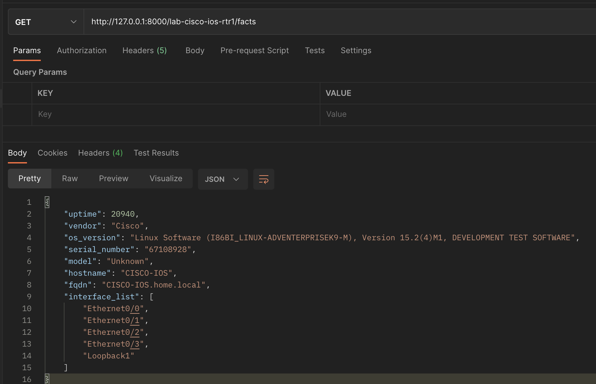

# Introduction

network-api is a tool that can be used to interact with your network using REST API calls.
It can be used to expose your network to developers who are more comfortable with the REST API
without having to understand the underlying protocol and complexities of interacting with the network programmatically.

# Technology Stack

The tool uses the following technology stack to provide a simple and intuitive interface for interacting with the network.

- **FastAPI** as a web framework for building APIs.
- **NAPALM** to interact with the actual network devices.

# Application Architecture

The application architecture can be illustrated in the below diagram.

The application is divided into two parts:

- **Frontend** - The frontend is a FastAPI application that provides a REST API interface for interacting with the network.
- **Backend** - The backend is a Python script that uses NAPALM to interact with the network.

# Folder Structure and Files

The below screenshot show the folder structure and files in the application.


The files are as follows:

- **main.py** - The main file that contains the FastAPI application.
- **std_errors.py** - A file that contains the standard error messages that are used by the application.
- **device_inventory.yaml** - A file that contains the details of the devices that are part of the network and how to connect to them.
- **endpoints/get_device_facts.py** - A file that contains the code for the GET {hostname}/facts endpoint. It also contains the
  NAPALM code to fetch the device facts.
- **endpoints/get_device_interfaces.py** - A file that contains the code for the GET /{hostname}/interfaces endpoint. It also contains the
  NAPALM code to fetch the device interfaces.

# Installation

The application can be installed using the following two methods.

If using poetry,

```
poetry install
```

If using venv and pip,

```
python -m venv .venv
pip install -r requirements.txt
```

# Starting the Application

The application can be started by executing the following command in the virtual
environment created during the installation process.

```
uvicorn app.main:app --reload
```

# Interacting with the Application

You can interact with the application using your choice of a web-browser or an API platform like Postman or simple curl commands.

For the sake of representation, below are screenshots of the GET /facts and GET /interfaces endpoints using Postman.

### device_facts



### device_interfaces


# API Documentation

FastAPI automatically generates interactive API documentation. The generated documentation follows the [Swagger 2.0](https://swagger.io/specification/) specification.

The API documentation can be viewed by accessing the following URL in your web browser.

```
http://localhost:8000/docs
```

# Improvements

The application is currently not optimized and it is a work in progress.
Some of the improvements to consider are:

- Authentication: Implement an authentication mechanism to restrict access to the application.
- Error handling: Implement better error handling for the application.
- Inventory Management: Implement a better way to manage the inventory of network devices such as Nornir or extract from a SOT such as NetBox/Nautobot.
